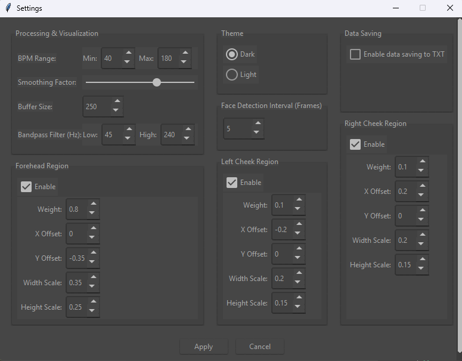

# Webcam Pulse Detector

## Overview
This project is a real-time pulse detection system that uses a webcam to measure heart rate by detecting subtle color changes in facial skin caused by blood flow. The system processes video frames to extract pulse signals and calculates the heart rate in beats per minute (BPM).

The project is inspired by [thearn/webcam-pulse-detector](https://github.com/thearn/webcam-pulse-detector/tree/no_openmdao), with enhancements in face tracking, signal processing, and visualization.


## Features
- **Real-time pulse detection**: Measures heart rate using a standard webcam
- **Multi-region tracking**: Tracks forehead and both cheeks for robust signal detection
- **Adjustable parameters**: Customize detection regions and weights
- **Signal processing**: Uses bandpass filtering and FFT to extract pulse frequency
- **Visualization**: Displays live video feed, pulse signal, and frequency spectrum
- **Face tracking**: Automatically detects and tracks faces for continuous measurement

## Installation
1. **Install dependencies**:
   ```bash
   pip install -r prerequisites.txt
   ```

2. **Clone the repository**:
   ```bash
   git clone https://github.com/0treble/WebcamPulseDetector
   cd webcam-pulse-detector
   ```

3. **Run the application**:
   ```bash
   python main.py
   ```

## Planned Features (TODO)
- [ ] Further data processing and SNR improvements
- [x] GUI interface (Tkinter)
  - [x] Checkboxes to enable/disable detection regions
  - [x] Adjustable:
    - [x] Detection box offsets
    - [x] Region weights
    - [x] Bandpass settings
    - [ ] Box widths/heights
- [ ] Export data functionality

## Usage
1. Position yourself in front of the webcam (well-lit environment works best)
2. The system will automatically detect your face and highlight:
   - Forehead (green rectangle)
   - Left cheek (orange rectangle)
   - Right cheek (orange rectangle)
3. View real-time displays:
   - Pulse waveform (top right)
   - Frequency spectrum with detected BPM (bottom right)
4. Current BPM and signal quality (SNR) are displayed above forehead region

## Technical Details
- **Face Detection**: Uses Haar Cascade classifiers with continuous tracking
- **Signal Extraction**: 
  - Green channel averaging from multiple facial regions
  - Weighted combination (80% forehead, 10% each cheek by default)
- **Signal Processing**:
  - DC component removal
  - Bandpass filtering (0.75-4.0 Hz corresponding to 45-240 BPM)
  - Hamming window applied before FFT
- **Pulse Detection**:
  - FFT frequency analysis
  - Peak detection in valid BPM range (40-180 BPM)
  - Temporal smoothing applied
  - SNR thresholding (minimum SNR = 2.0)

## Customization Options
You can use the built-in options menu in the top-right corner of the running program to dynamically
change the parameters



or you can also adjust the default values in `processor.py`:
- `buffer_size`: Number of frames to analyze (default: 250)
- `region_weights`: Contribution of each region to final signal
- `valid_pulse_range`: Acceptable BPM range (default: 50-160)
- `smoothing_factor`: How much to smooth BPM readings

## Notes
- Works best in consistent, natural lighting
- Signal quality improves with longer measurement periods
- This is a hobby project - not medical grade accuracy
